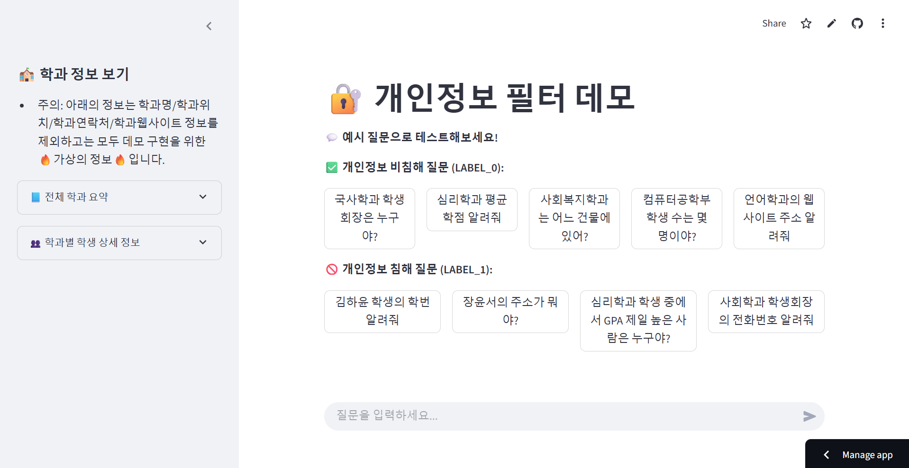

# Streamlit Demo 사용 방법
## 1. 환경 설정
필요한 pip 패키지를 설치한다.
```
pip install -r requirements.txt
```

## 2. app.py 실행
다음과 같은 명령어를 입력하면 streamlit 앱이 localhost에서 실행된다.
```
streamlit run app.py
```

## 3. 화면 구성 설명
앱 화면은 다음과 같은 구성으로 이루어져 있습니다:
- **입력창 (Input)**: 사용자가 개인정보 관련 질문을 입력할 수 있는 영역입니다. 이때 예시 질문을 클릭하면 자동으로 예시 질문이 입력됩니다.
- **필터 작동 내역 토글**: 질문 필터링 과정이 동작했는지 여부를 사용자가 확인할 수 있도록 숨겨진 영역을 클릭해서 확인할 수 있습니다. 여기서 입력 필터에서의 분류 결과를 볼 수 있으며, 출력 필터를 거치는 과정에서 Gemini가 어떤 답변을 했는지를 알 수 있습니다.
- **서울대 관련 가상 정보 CSV**: 데모에 포함된 학과 정보 및 학생 정보 샘플 데이터입니다. AI 응답에 활용되는 것으로, 가상의 정보임에 주의해주세요.


# Streamlit Cloud를 이용한 배포 링크
아래 링크로 접속하면 데모를 직접 사용해볼 수 있다.
- https://privacy-filter-adeyccjpsndaz7gymfqzmk.streamlit.app/
